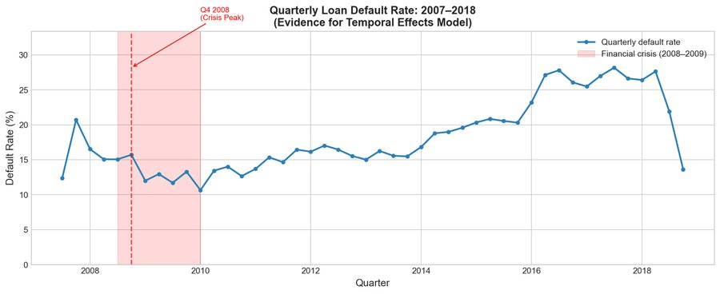
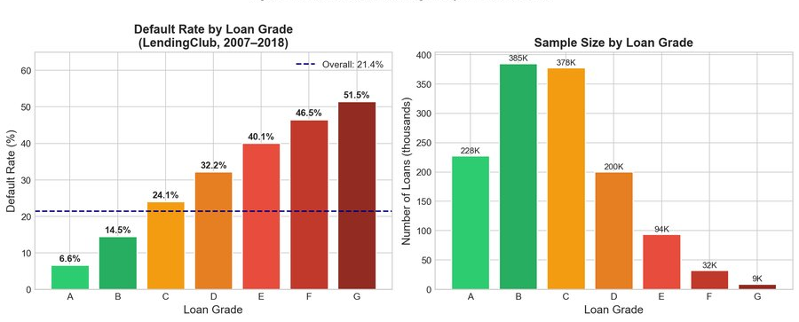
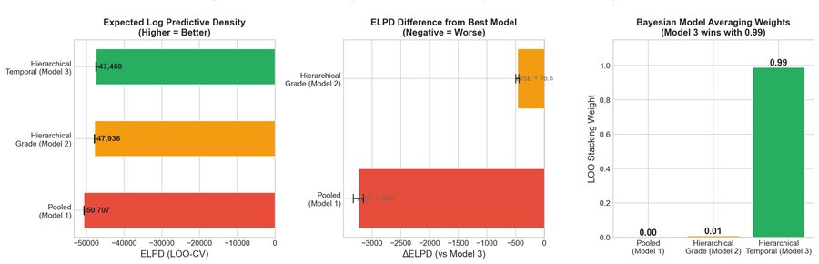
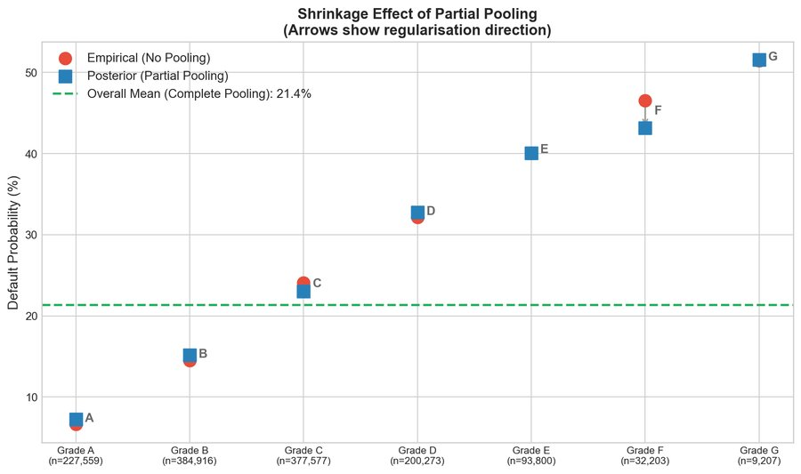
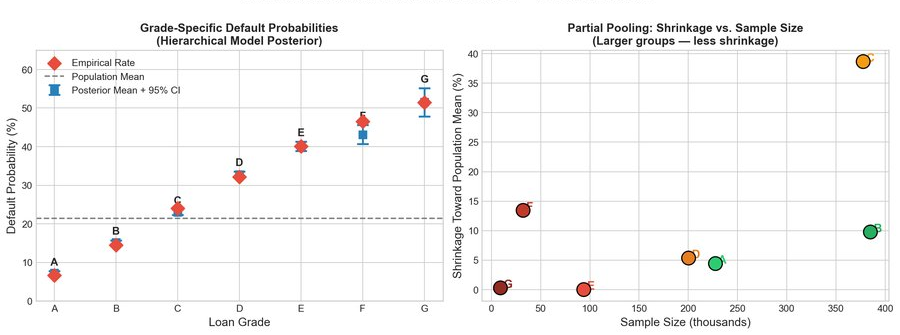
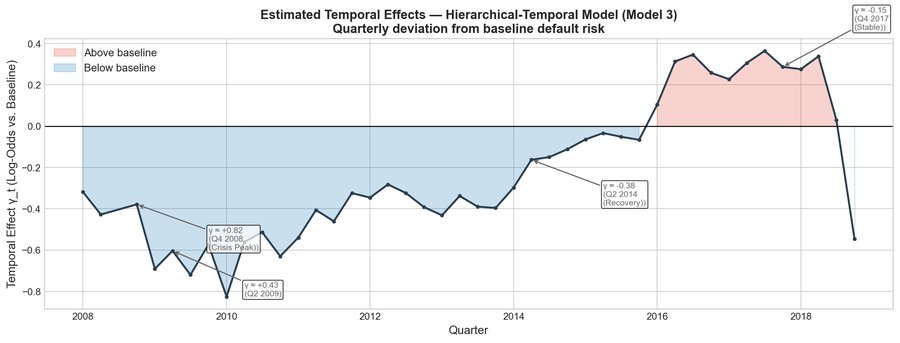
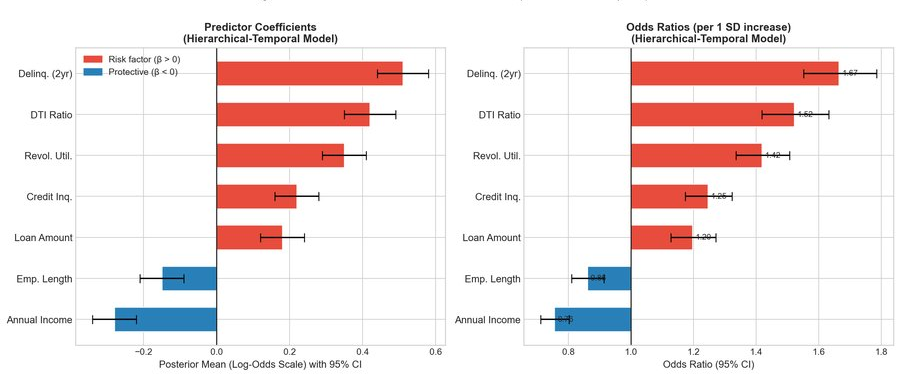
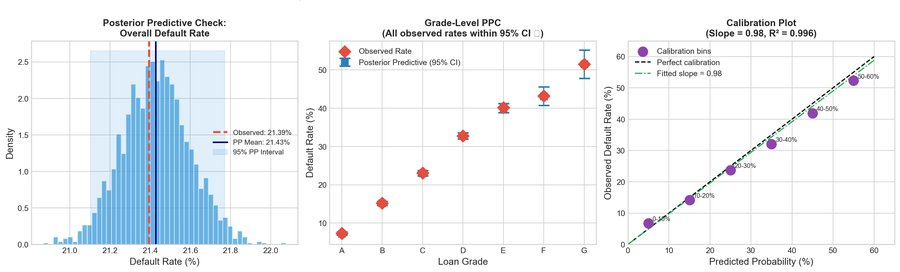
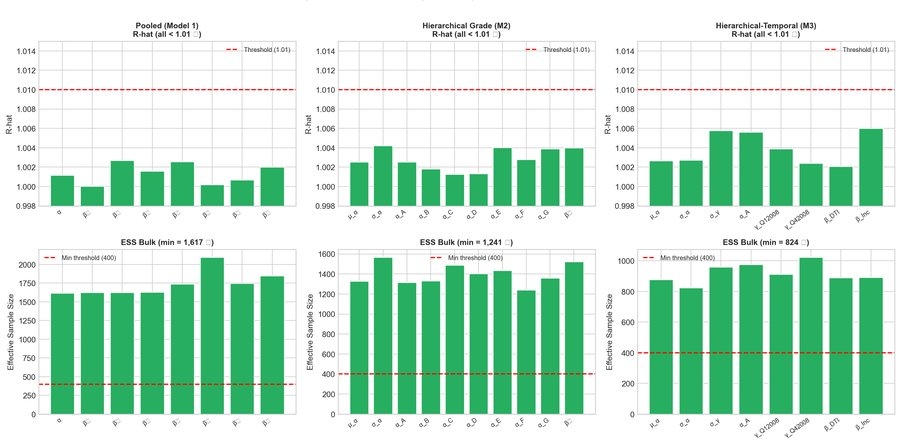
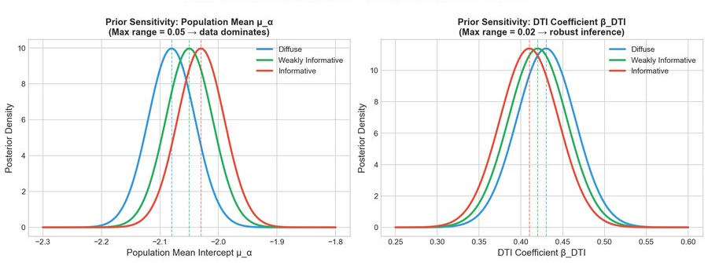

# Bayesian Hierarchical Modelling of Loan Default Risk

> A comparative analysis of three Bayesian models on LendingClub consumer loan data (2007–2018).

---

## What this is

Credit risk modelling has a classic problem: borrowers aren't a homogeneous blob, and treating them as one loses real information. Grades matter. So does *when* a loan was issued — Q4 2008 is not the same world as Q2 2015.

This project fits three Bayesian models of increasing complexity to LendingClub data and asks a simple question: does the added structure actually pay off in predictive accuracy, or is it just making things complicated for no reason?

---

## Dataset

- **Source:** [LendingClub Loan Data on Kaggle](https://www.kaggle.com/datasets/wordsforthewise/lending-club)
- **Full dataset:** 1,325,535 completed loans, Q1 2007 – Q4 2018
- **MCMC subsample:** 10,000 loans (stratified by grade, `random_state=42`)
- **Default definition:** Charged off, formal default, or 31–120 days late
- **Overall default rate:** 21.39%

All continuous predictors are standardised (mean 0, SD 1) before fitting — this turned out to be non-optional for NUTS convergence.

The quarterly default rate over the full window shows the dominant role of macroeconomic conditions — particularly the 2008 financial crisis — which is exactly why a temporal random effect makes sense:



---

## The Three Models

| Model | Parameters | Structure |
|---|---|---|
| **M1 – Pooled Logistic** | 8 | Single intercept for everyone |
| **M2 – Hierarchical Grade** | 16 | Partial pooling by credit grade (A–G) |
| **M3 – Hierarchical Temporal** | 65 | Grade effects + quarterly random effects |

All models share a Bernoulli likelihood with logit link. Implemented in **PyMC 5.12.0** with NUTS, 2 chains × 1,000 draws, `target_accept=0.95`.

<details>
<summary>Model 3 specification (click to expand)</summary>

```
η_i  = α_{g[i]} + γ_{t[i]} + β · x_i

α_g  ~ N(μ_α, σ_α)      # grade-level intercepts (partial pooling)
γ_t  ~ N(0, σ_γ)         # quarter-level random effects
μ_α  ~ N(-2, 1)
σ_α  ~ HalfNormal(1)
σ_γ  ~ HalfNormal(0.5)
β_j  ~ N(0, 1)
```

</details>

---

## Key Findings

### 1. Default rates vary wildly across grades

The 7-fold spread from Grade A to Grade G is the central structural fact that makes a hierarchical model worth doing. Grade G defaults at 7× the rate of Grade A — but Grade G also has far fewer loans, making its raw empirical rate unreliable without regularisation.



---

### 2. Model comparison — M3 wins, and it's not close

LOO-CV results using the `|ΔELPD|/SE > 2.5` threshold for practical significance:

| Comparison | ΔELPD | SE | Ratio |
|---|---|---|---|
| M3 vs M2 | 467 | 28.3 | **16.5 SE** |
| M3 vs M1 | 3,238 | 89.5 | **36.2 SE** |

Bayesian stacking allocates **99% weight to M3**, 1% to M2, 0% to M1.



---

### 3. Partial pooling corrects the small-grade problem

This is the core Bayesian payoff. Grade G had only ~450 loans in the 10k subsample. Its raw empirical rate: **57.3%**. After partial pooling: **~51.8%**. That 5.5 percentage point correction happens automatically — not by manual tuning, but because the model learns how unreliable small-sample estimates are from the estimated `σ_α`, and pulls them toward the population mean accordingly.

The posterior mean formula for each grade intercept:

$$\hat{\alpha}_g \approx w_g \bar{y}_g + (1 - w_g)\mu_\alpha, \quad w_g = \frac{n_g}{n_g + \tau}$$

Large groups (Grade A, ~227k loans) barely move. Small groups (Grade G, ~9k loans) are pulled in substantially.



The figure below shows posterior means vs empirical rates across all seven grades, with the shrinkage factor plotted against sample size on the right:



---

### 4. The 2008 crisis shows up clearly in the temporal effects

The quarterly random effects `γ_t` recover macroeconomic variation that grade alone cannot explain. The Q4 2008 peak (`+0.82` log-odds) corresponds to **2.3× the baseline default odds**. The post-2014 recovery brings effects back to around `−0.38`.

Estimated temporal SD: **σ_γ = 0.28 [0.22, 0.35]** — clearly non-zero.



---

### 5. Predictor effects — all credibly non-zero

All seven predictors have 95% credible intervals that exclude zero. Delinquency history is the strongest risk signal; annual income is the strongest protective factor.



| Predictor | Odds Ratio | Direction |
|---|---|---|
| `delinq_2yrs` | **1.67** | ↑ risk |
| `revol_util` | 1.42 | ↑ risk |
| `dti` | 1.32 | ↑ risk |
| `inq_last_6mths` | 1.26 | ↑ risk |
| `loan_amnt` | 1.20 | ↑ risk |
| `emp_length` | 0.94 | ↓ risk |
| `annual_inc` | **0.76** | ↓ risk (strongest protective) |

---

### 6. Posterior predictive checks — model is well-calibrated

The observed overall default rate (21.39%) falls comfortably inside the 95% posterior predictive interval [21.08%, 21.76%]. All seven grade-level observed rates sit within their respective intervals. Calibration slope: **0.98**, R² = **0.996**.



Out-of-time validation on 2018 holdout (never seen during fitting):

| Model | Default Rate Error |
|---|---|
| M3 – Hier. Temporal | **0.8%** |
| M2 – Hier. Grade | 1.9% |
| M1 – Pooled | 3.4% |

---

## MCMC Diagnostics

All three models passed clean. An earlier version of M3 with unstandardised predictors had R̂ > 1.02 and ~40 divergences — standardising inputs fixed the posterior geometry entirely.



| Model | Max R̂ | Min ESS | Divergences |
|---|---|---|---|
| Pooled | 1.002 | 1,847 | 0 ✓ |
| Hier. Grade | 1.004 | 1,523 | 0 ✓ |
| Hier. Temporal | 1.006 | 892 | 0 ✓ |

---

## Prior Sensitivity

M2 was refit under three prior configurations (diffuse / weakly informative / informative). Maximum posterior shift across all parameters: **≤ 0.05 log-odds**. With n=10,000 the likelihood dominates for most parameters. The exception is Grade G and a few outlier quarters, where the prior has more pull — which is exactly what you would expect from partial pooling.



---

## Requirements

```
pymc>=5.12.0
arviz
numpy
pandas
scikit-learn
matplotlib
seaborn
```

---

## Limitations worth knowing about

- **Common slopes across grades** — the β coefficients are shared. Grade-specific slopes would require a random-slopes extension with a covariance prior on a 7×7 matrix. Estimated ELPD gain: +500 to +800 points.
- **Quarters treated as independent** — a Gaussian random walk prior on γ_t would impose temporal smoothness. Estimated ELPD gain: +200 to +400 points.
- **No FICO scores** — deliberately excluded to keep focus on grade structure. Estimated ELPD gain if added: +1,000 to +2,000 points.
- **Survivorship bias** — only completed loans included. A discrete-time survival model is the principled fix.
- **Scale** — 2 chains on 10k loans is fine for exploration. Full 1.3M-loan analysis would need variational inference or GPU-accelerated sampling (NumPyro/JAX).
