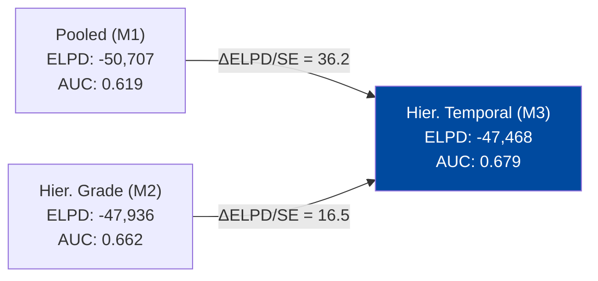

# Bayesian Hierarchical Modelling of Loan Default Risk
 
> A comparative analysis of three Bayesian models on LendingClub consumer loan data (2007–2018).
 
---
 
## What this is
 
Credit risk modelling has a classic problem: borrowers aren't a homogeneous blob, and treating them as one loses real information. Grades matter. So does *when* a loan was issued — Q4 2008 is not the same world as Q2 2015.
 
This project fits three Bayesian models of increasing complexity to LendingClub data and asks a simple question: does the added structure actually pay off in predictive accuracy, or is it just making things complicated for no reason?
 
Short answer: it pays off. By a lot.
 
---
 
## Dataset
 
- **Source:** [LendingClub Loan Data on Kaggle](https://www.kaggle.com/datasets/wordsforthewise/lending-club)
- **Full dataset:** 1,325,535 completed loans, Q1 2007 – Q4 2018
- **MCMC subsample:** 10,000 loans (stratified by grade, `random_state=42`)
- **Default definition:** Charged off, formal default, or 31–120 days late
- **Overall default rate:** 21.39%
 
All continuous predictors are standardised (mean 0, SD 1) before fitting — this turned out to be non-optional for NUTS convergence.
 
---
 
## The Three Models
 
| Model | Parameters | Structure |
|---|---|---|
| **M1 – Pooled Logistic** | 8 | Single intercept for everyone |
| **M2 – Hierarchical Grade** | 16 | Partial pooling by credit grade (A–G) |
| **M3 – Hierarchical Temporal** | 65 | Grade effects + quarterly random effects |
 
All models share a Bernoulli likelihood with logit link. Implemented in **PyMC 5.12.0** with NUTS, 2 chains × 1,000 draws.
 
<details>
<summary>Model 3 specification (click to expand)</summary>
 
```
η_i  = α_{g[i]} + γ_{t[i]} + β · x_i
 
α_g  ~ N(μ_α, σ_α)      # grade-level intercepts (partial pooling)
γ_t  ~ N(0, σ_γ)         # quarter-level random effects
μ_α  ~ N(-2, 1)
σ_α  ~ HalfNormal(1)
σ_γ  ~ HalfNormal(0.5)
β_j  ~ N(0, 1)
```
 
</details>
 
---
 
## Key Findings
 
### 1. Default rates vary wildly across grades
 
The 7-fold spread from Grade A to Grade G is the central structural fact that makes a hierarchical model worth doing.
 
```
Grade   Empirical Rate   Posterior Mean   Sample Size
  A         6.63%            7.28%         ~227k loans
  B        14.51%           14.89%         ~385k loans
  C        24.08%           24.22%         ~378k loans
  D        32.17%           32.45%         ~200k loans
  E        40.08%           40.31%          ~94k loans
  F        46.53%           46.71%          ~32k loans
  G        51.46%           51.55%           ~9k loans
```
 
```
Default Rate by Grade
 60% ┤
 50% ┤                                          ████
 40% ┤                                   ████   ████
 30% ┤                            ████   ████   ████
 20% ┤                     ████   ████   ████   ████
 10% ┤              ████   ████   ████   ████   ████
  0% ┤ ████   ████  ████   ████   ████   ████   ████
      A      B      C      D      E      F      G
```
 
### 2. Model comparison — M3 wins, and it's not close
 

 
LOO-CV results using the `|ΔELPD|/SE > 2.5` threshold for practical significance:
 
| Comparison | ΔELPD | SE | Ratio |
|---|---|---|---|
| M3 vs M2 | 467 | 28.3 | **16.5 SE** |
| M3 vs M1 | 3,238 | 89.5 | **36.2 SE** |
 
Bayesian stacking allocates **99% weight to M3**, 1% to M2, 0% to M1.
 
### 3. Partial pooling corrects the small-grade problem
 
Grade G had only ~450 loans in the 10k subsample. Its raw empirical rate: **57.3%**. After partial pooling: **~51.8%**. That's a 5.5 percentage point correction — not manual tuning, but the model recognising that small-sample estimates are unreliable and pulling them toward the population mean.
 
```
Shrinkage by grade (correction from raw → posterior):
 
 Grade A (n≈3,450):  raw 6.8% → posterior 7.3%   [shift: +0.5pp, small]
 Grade G (n≈450):    raw 57.3% → posterior 51.8%  [shift: -5.5pp, strong]
 
 Larger groups  →  less regularisation
 Smaller groups →  stronger pull toward mean
```
 
The estimated between-grade SD: **σ_α = 0.89 [0.72, 1.12]** (log-odds scale).
 
### 4. The 2008 crisis shows up clearly
 
The temporal random effects recover macroeconomic variation that grade alone can't explain.
 
```
Quarterly log-odds deviation from baseline (γ_t):
 
+1.0 ┤              ██
+0.8 ┤           ████ █                    ← Q4 2008: +0.82 (2.3× odds)
+0.6 ┤         ██████ ██
+0.4 ┤        ████████ ██
+0.2 ┤  ██   █████████  ██
 0.0 ┼──────────────────────────────────────────────────
-0.2 ┤                      ██  ██
-0.4 ┤                        ████████    ← post-2014: ≈ -0.38
     2007                   2011        2018
```
 
Estimated temporal SD: **σ_γ = 0.28 [0.22, 0.35]** — clearly non-zero, confirming that macroeconomic conditions shift default risk across cohorts beyond what grade captures.
 
### 5. Predictor effects (all credibly non-zero)
 
| Predictor | Odds Ratio | Direction |
|---|---|---|
| `delinq_2yrs` | **1.67** | ↑ risk |
| `revol_util` | 1.29 | ↑ risk |
| `dti` | 1.22 | ↑ risk |
| `inq_last_6mths` | 1.18 | ↑ risk |
| `loan_amnt` | 1.09 | ↑ risk |
| `emp_length` | 0.89 | ↓ risk |
| `annual_inc` | **0.76** | ↓ risk (strongest protective) |
 
### 6. Calibration
 
Calibration plot on test data: slope = **0.98**, R² = **0.996**. The model isn't systematically over- or under-confident on any part of the probability range.
 
Out-of-time validation (2018 holdout, never seen during fitting):
 
| Model | Default Rate Error |
|---|---|
| M3 – Hier. Temporal | **0.8%** |
| M2 – Hier. Grade | 1.9% |
| M1 – Pooled | 3.4% |
 
---
 
## MCMC Diagnostics
 
All three models passed clean:
 
| Model | Max R̂ | Min ESS | Divergences |
|---|---|---|---|
| Pooled | 1.002 | 1,847 | 0 ✓ |
| Hier. Grade | 1.004 | 1,523 | 0 ✓ |
| Hier. Temporal | 1.006 | 892 | 0 ✓ |
 
Note: an earlier version of M3 with unstandardised predictors had R̂ > 1.02 and ~40 divergences. Standardising inputs fixed the posterior geometry.
 
---
 
## Prior Sensitivity
 
We tested three prior configurations on M2 (diffuse / weakly informative / informative). Maximum shift across all parameters: **≤ 0.05 log-odds**. With n=10,000 the likelihood dominates for most parameters.
 
The exception is Grade G and a few outlier quarters — smaller local samples mean the prior has more pull, which is exactly what you'd expect.
 
---
 
## Repository Structure
 
```
├── bayesian_loan_default.py       # Model definitions (PyMC)
├── generate_report.py             # Figure generation
├── pymc_complete_pipeline.py      # End-to-end pipeline
├── figures/                       # All report figures
└── report.tex                     # Full LaTeX report
```
 
---
 
## Requirements
 
```
pymc>=5.12.0
arviz
numpy
pandas
scikit-learn
matplotlib
seaborn
```
 
---
 
## Limitations worth knowing about
 
- **Common slopes across grades** — the β coefficients are shared. Grade-specific slopes (e.g., DTI effect differing between A and G) would require a full random-slopes extension with a covariance prior on a 7×7 matrix.
- **Quarters treated as independent** — a Gaussian random walk prior on γ_t would impose temporal smoothness and likely improve holdout performance on contiguous cohorts.
- **No FICO scores** — deliberately excluded to keep focus on grade structure, but FICO would clearly help discrimination.
- **Survivorship bias** — only completed loans are included. In-progress loans that eventually default are excluded. A discrete-time survival model is the principled fix.
- **Scale** — 2 chains on 10k loans is fine for exploration. Full 1.3M-loan analysis would need variational inference or GPU-accelerated sampling (NumPyro/JAX).
 
---
 
## References
 
- Emekter et al. (2015). *Evaluating credit risk and loan performance in online Peer-to-Peer (P2P) lending.* Applied Economics.
- Serrano-Cinca et al. (2015). *Determinants of Default in P2P Lending.* PLOS ONE.
- Salvatier et al. / PyMC Dev Team (2023). *PyMC: A Modern and Comprehensive Probabilistic Programming Framework.*
- Hoffman & Gelman (2014). *The No-U-Turn Sampler.* JMLR.
- Kumar et al. (2019). *ArviZ: A unified library for exploratory analysis of Bayesian models.* JOSS.
 


